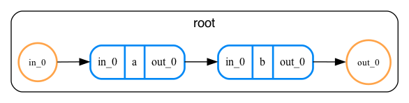

# Compilation

Here we will describe how the compilation process in `bartiq` works.
Please keep in mind, that while we try to keep this page up-to-date, in the end the code is the only source-of-truth. If you notice any discrepancies between what is described here and how `bartiq` behaves, please [create an issue](https://github.com/PsiQ/bartiq/issues)!

## Bird's eye perspective on compilation

Compilation is a very overloaded word, so let us start by explaining what we mean by *compiling a routine* in `bartiq`.

Quantum programs are often deeply nested structures. A program can call multiple routines, which themselves call other routines, and so on. One typically defines resources of each routine at the local level using locally defined symbols and variables. However, in the end, we are typically interested in resources used by each routine expressed in terms of input parameters of the whole program.

Here's an example to illustrate what we're talking about. Below we show a routine with
two children, each of them having some example resource defined in terms of their local parameters.


```yaml
--8<-- "docs/data/compilation_example.yaml"
```




As we can see, both `a` and `b` have a resource `x` defined relatively to their input port size `L`. However, when
looked globally, those resources would have a different value. Indeed, let's see how the port sizes propagate.

1. The input port of the top-level `root` routine of size `N` is connected to the input port of routine `a`. Hence,
   when viewed through global scope, the input port of `a` has size `N`.
2. The output port of routine `a` has, by definition, size twice as large as its input port. It is connected to input port
   of routine `b`, and therefore `b.in_0` has size `2N`.

Looking at the resources of `a` and `b` we see that `x` is defined as square of their respective input port sizes. Thus,
`a.x` has value of `N ** 2`, and `b.x` has value `(2 * N) ** 2 = 4 * N ** 2`.

This is what the compilation process is all about. Given a routine with all its components defined in terms of local symbols
and parameters, `bartiq` produces a *compiled routine* in which all port sizes and resources are defined in terms
of the global input symbols of top-level routine.


## Compilation in details

Compilation can be viewed as recursive process. At every recursive call, several things need to happen in correct order.
Below we outline how the compilation proceeds.

### Step 1: Preprocessing

The `bartiq`'s compilation engine makes several assumptions about the routine being compiled, which simplify its code
at the expense of flexibility. For instance, `bartiq` assumes all port sizes are single parameters of size `#port_size`.
Another (very important) assumption is that there are no parameter links reaching deeper than one level of nesting.

Writing a routine conforming to those requirements by hand is possible, but tedious. Instead, `bartiq` allows for
violation of some of its assumptions, and preprocesses the routine so that all the requirements are met.

As an example, suppose some port `in_0` has size `1`. `bartiq` replaces this size with `#in_0`, and then adds a
constraint saying that `#in_0 = 1`.


Currently, the  following preprocessing stages take place prior to compilation:

1. Introduction of default additive resources. This stage allows users to define the additive resources for leafs,
   and then adds the same resource to each of the higher-level routines, by defining it as a sum of the resource over all children that define it.
   In the example we discussed previously, this preprocessing step would allow uas to skip the definition of
   `x` resource in `root` and instead have it automatically defined by `bartiq`.
2. Propagation of linked params. In this stage all linked parameters reaching further than a direct
   descendant are converted into a series of direct parameter links. This is useful because you can, for example,
   link a parameter from the top-level routine to a parameter arbitrarily deep in the program structure. This is will compile correctly, despite `bartiq`'s compilation engine requirement on having only direct links.
3. Promotion of unlinked inputs. Compilation cannot handle parameters that are not linked or pased through
   connections. To avoid unnecessary compilation errors, `bartiq` will promote such parameters by linking it to newly introduced input in the parent routine.
4. Introduction of port variables. As discussed above, this step converts all ports so that they have sizes
   equal to a single-parameter expression of known name, while also introducing constraints to make sure
   that no information is lost in the process.

It is hopefully clear by now that preprocessing allows users to write more concise and readable routines, while at the same time
ensuring that strict requirements of the compilation engine are met.

### Step 2: Recursive compilation of routines

As already mentioned, the compilation process is recursive. During compilation `bartiq`
maintains a parameter map for all of the routine's children. This map gets populated whenever a new piece of
information is obtained, and then passed to the recursive call when each child is being compiled.

What follows is a high-level, ordered overview of the main compilation process, where information is passed along edges of the routine graph.

#### Step 2.1: Constraint validation

First, `bartiq` evaluates the constraints introduced in preprocessing. If any
of the constraints is violated, a `BartiqCompilationError` is raised. Constraints that are trivially satisfied
are dropped from the system, and other constraints are retained.

#### Step 2.2: Redefining local variables

As the next step, local variables of the routine are expressed in terms of variables passed from its parent (this
step does nothing for the root routine). As the result, all local variables are expressed in terms of global
parameters.

#### Step 2.3: Input- and through-port sizes are compiled

For any given routine, input and through ports must have sizes that only depend on local inputs and variables.After each port is compiled, `bartiq` checks if this port is connected to others in the program. If so, a
corresponding entry in parameter map is added. For instance, suppose that port `in_0` got compiled and has now
size `N`. If this port is connected to port `in_1` of child `a`, a parameter map for `a` will contain entry
mapping `#in_1` to `N`.


#### Step 2.4: Child traversal

The children are traversed in topological order, which ensures all required entries in the parameter maps are
populated before other children are compiled.

Once this step is completed, we can be sure that all resources and ports of each child are expressed in terms
of global variables, which is a requirement for the next step.

#### Step 2.4: Repetitions

In case a routine is repeated (i.e. has a non-empty `repetition` field), its local resource definitions get updated according 
to the repetition rules; the repetition specification itself gets updated using the parameter map.

#### Step 2.5: Resource compilation

At this stage each child should have input and through ports defined in terms of global variables, and we can now compile the resources. Parents have their resources updated from the compiled resources of their children.

#### Step 2.6: Output port compilation

The output ports are compiled, and the new object representing compiled routine is created.

#### Step 2.7 Adding derived resources

Finally, derived resources (provided through `derived_resources` field) are calculated and added to the routine. These resources are not provided in the initial routine (or at least not for all of the subroutines) and need to be calculated based on the existing information.

### Step 3: Postprocessing

After compilation is done, there might be certain operations that the user might want to perform on a compiled routine, e.g.: aggregating resources.
Currently, there are no postprocessing steps by default.